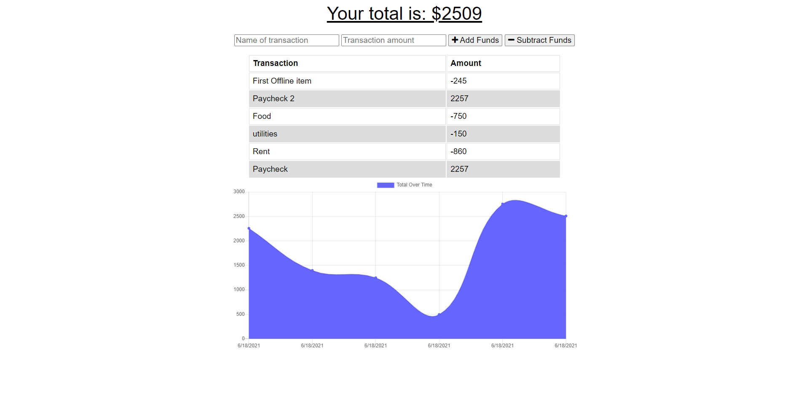

#  Budget Tracker

  

  ## Description
  Budget Tracker an app to track your budget. user can input fund and subtract funds and keep track of all expenses. The app in online and uses mongoDB atlas and heruku for deployment. App has fully off line capabilities. user can download the app into their computers or phones and keep track of budget even without internet service. once internet service is restore and items created offline are update it on cloud. 

  ## Table of Contents

  * [App-Screenshot](#App-Screenshot)
  * [Installation](#installation)
  * [Contribution](#contribution)
  * [License](#license)
  * [Questions](#questions)

  
  ## App-Screenshot

  

  ## Installation
  No installation prodecures. App is online. To download to your app to your device click the download button on the url bar in your google chrome. 

  ## Link to Deployed Application
  https://budget-tracker-hbbc248.herokuapp.com/

  ## Contribution
  Anybody is free to contribute to this project as desired. Just contact me via email to present your new ideas to add to this project.

  ## License
  This project was done under the MIT license to know more about it, please click here: [MIT](https://choosealicense.com/licenses/mit/)

  ## Questions
  Please visit my GitHub page: https://github.com/hbbc248
  
  For more information please email me at: ibrahimzerlin@hotmail.com

 